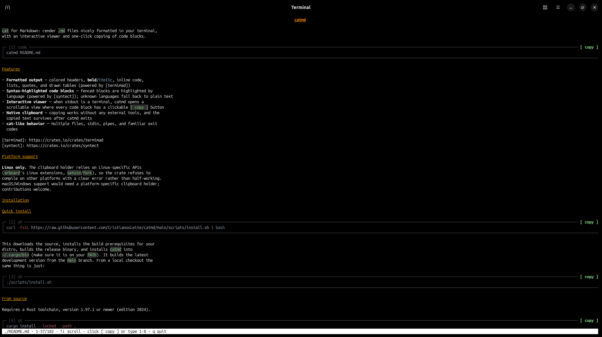

# catmd

`cat` for Markdown: render `.md` files nicely formatted in your terminal,
with an interactive viewer and one-click copying of code blocks.

```
catmd README.md
```



## Features

- **Formatted output** — colored headers, **bold**/*italic*, inline code,
  lists, quotes, and drawn tables (powered by [termimad])
- **Syntax-highlighted code blocks** — fenced blocks are highlighted by
  language (powered by [syntect]); unknown languages fall back to plain text
- **Interactive viewer** — when stdout is a terminal, catmd opens a
  scrollable view where every code block has a clickable `[ copy ]` button
- **Native clipboard** — copying works without any external tools, and the
  copied text survives after catmd exits
- **cat-like behavior** — multiple files, stdin, pipes, and familiar exit
  codes

[termimad]: https://crates.io/crates/termimad
[syntect]: https://crates.io/crates/syntect

## Platform support

**Linux only.** The clipboard holder relies on Linux-specific APIs
(`arboard`'s Linux extensions, `setsid`/`fork`), so the crate refuses to
compile on other platforms with a clear error rather than half-working.
macOS/Windows support would need a platform-specific clipboard holder;
contributions welcome.

## Installation

### Quick install

```sh
curl -fsSL https://raw.githubusercontent.com/CristianosLeite/catmd/main/scripts/install.sh | bash
```

This downloads the source, installs the build prerequisites for your
distro, builds the release binary, and installs `catmd` into
`~/.cargo/bin` (make sure it is on your `PATH`). It builds the latest
development version from the `main` branch. From a local checkout the
same thing is just:

```sh
./scripts/install.sh
```

### From source

Requires a Rust toolchain, version 1.97.1 or newer (edition 2024).

```sh
cargo install --locked --path .
```

This installs the `catmd` binary into `~/.cargo/bin` (make sure it is on
your `PATH`).

### Build script

If you don't have a toolchain set up yet, `scripts/build-linux.sh` does the
whole thing: it detects your distro (Debian/Ubuntu, Fedora/RHEL, Arch,
openSUSE, Alpine), installs the build prerequisites (C compiler,
`pkg-config`, `curl`) with the native package manager, bootstraps Rust via
[rustup] if it's missing, and builds the release binary.

```sh
./scripts/build-linux.sh            # install prerequisites + build target/release/catmd
./scripts/build-linux.sh --install  # also install to ~/.cargo/bin
```

Package installation uses `sudo` when run as a regular user; if everything
is already installed, the script skips straight to the build and needs no
privileges.

[rustup]: https://rustup.rs

## Usage

```sh
catmd file.md              # open file.md in the interactive viewer
catmd a.md b.md            # several files in one scrollable view
curl -s example.com/x.md | catmd     # read from stdin
catmd - < notes.md         # "-" also means stdin
catmd file.md | less -R    # piped output is plain formatted text
catmd --plain file.md      # force plain output in a terminal
catmd -- -dashed-name.md   # "--" ends option parsing (dash-prefixed files)
catmd --help               # show help
catmd --version            # show version
```

### Interactive viewer

Opens automatically when stdout is a terminal (skip it with `--plain`).

| Key / action           | Effect                                                                                                                                           |
|------------------------|--------------------------------------------------------------------------------------------------------------------------------------------------|
| `↑`/`↓` or `k`/`j`     | scroll one line                                                                                                                                  |
| mouse wheel            | scroll                                                                                                                                           |
| `PageUp` / `PageDown`  | scroll one screen (also `Space`)                                                                                                                 |
| `g` / `G` (Home / End) | jump to top / bottom                                                                                                                             |
| click `[ copy ]`       | copy that code block to the clipboard                                                                                                            |
| type a block number    | copy that block; fires as soon as the number is unambiguous, `Enter` confirms an ambiguous prefix (e.g. `1` when block 12 exists), `Esc` cancels |
| `q`, `Esc`, `Ctrl-C`   | quit                                                                                                                                             |

Every code block is drawn in a numbered box:

```
┌─ [1] bash ──────────────────────────────── [ copy ]
│ sudo apt install something
└────────────────────────────────────────────────────
```

Clicking `[ copy ]` (or pressing `1`) puts the block's source text on the
system clipboard; the status bar confirms the copy. Fences inside block
quotes (`> ```…`) and fences indented up to 3 spaces (e.g. in a list item)
get copy buttons too; the copied text is the block's CommonMark content —
quote markers and opener indentation stripped, line endings preserved.
Fences nested deeper than that are rendered as prose without a button.

The copied text is byte-exact, but the *display* strips terminal control
characters and bidi overrides for safety. When a copied block contains
characters that are invisible on screen (controls, bidi overrides,
zero-width characters), the status bar adds **“⚠ contains hidden
characters”** — review such a block before pasting it into a shell.

Note: while the viewer is open it captures the mouse, so normal
drag-to-select is disabled — most terminals still allow native selection
while holding `Shift`.

### Exit codes

Like `cat`: `0` on success, `1` if any file could not be read (the
remaining files are still rendered, errors go to stderr).

## Clipboard mechanics

Copying tries, in order:

1. **System tools** — `wl-copy` (Wayland) or `xclip`/`xsel` (X11), if
   installed
2. **Native** — a direct connection to the display server via [arboard];
   no external tools needed. Because a Linux clipboard only lives as long
   as the process that set it, catmd hands the text to a small detached
   `catmd` background process that serves the clipboard until another
   application takes ownership (the same trick `wl-copy` uses)
3. **OSC 52** — a terminal escape sequence, useful over SSH; requires
   terminal support. There is no way to detect that support, so its status
   message says so ("via osc52 (needs terminal support)")

The status bar shows which mechanism was used (e.g. "via native").

[arboard]: https://crates.io/crates/arboard

## Development

```sh
cargo test      # unit + integration tests
cargo clippy    # lints
cargo run -- sample.md
```

### Code layout

| File                 | Responsibility                                        |
|----------------------|-------------------------------------------------------|
| `src/main.rs`        | entry point: reads files, picks interactive vs. plain |
| `src/cli/mod.rs`     | argument parsing and usage text                       |
| `src/segment/mod.rs` | splits markdown into prose and fenced code blocks     |
| `src/render/mod.rs`  | styling: termimad for prose, syntect for code         |
| `src/viewer/mod.rs`  | interactive full-screen viewer (scroll, mouse, copy)  |
| `src/clipboard.rs`   | clipboard back-ends and the detached holder process   |
| `src/*/tests.rs`     | unit tests for the matching module                    |
| `tests/cli.rs`       | end-to-end tests against the built binary             |

## License

MIT — see [LICENSE](LICENSE).
